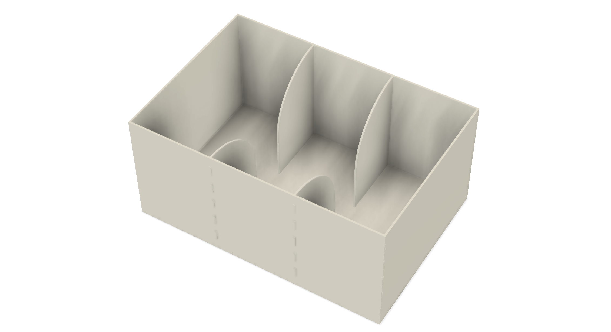

# 3-chamber

This is a parametric design of the 3-chamber apparatus for studying socialization, modified to accomodate movement with a tether.

Chamber dimensions: 17.5 x 26 x 12"

Material thickness: 5.9mm

Door width: 4"

## Components
- [6mm opaque clear acrylic sheets](https://www.polymershapes.com/product/acrylic/)

## Build instructions
- Adjust dimensions of the [f3d file](CAD/model.f3d) using the `change parameters` menu in [Fusion 360][Fusion360], export to `dxf` in `manufacturing mode` and setup a laser cutting machine to cut all parts.
- Remove protective film.
- Assemble all acrylic parts using painter's tape and apply acrylic cement or 2-part epoxy. Remove painter's tape after drying.

## Version History
### 0.1.0
* 2024-05-27
  - Initial Release.

## License
© 2024 [Leonardo Molina][Leonardo Molina]

This project is licensed under the [Creative Commons BY-NC-SA 4.0 License](https://creativecommons.org/licenses/by-nc-sa/4.0/).

[Leonardo Molina]: https://github.com/leomol
[LICENSE.md]: LICENSE.md
[Fusion360]: https://www.autodesk.com/ca-en/products/fusion-360